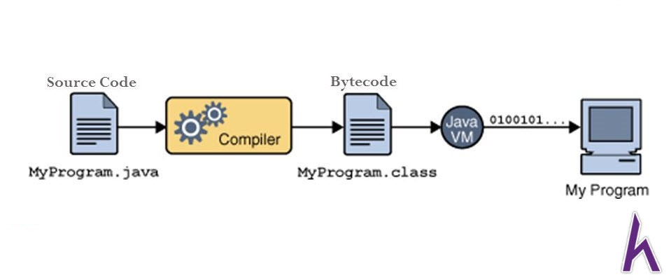
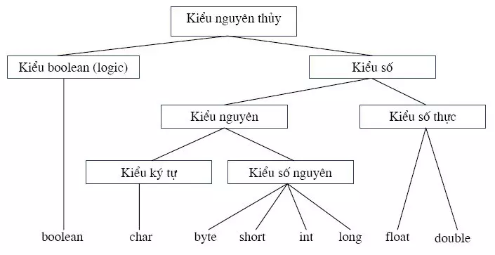
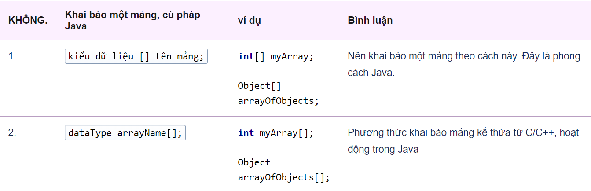

# BUỔI 1 - WELCOME TO JAVA 
- [BUỔI 1 - WELCOME TO JAVA](#buổi-1---welcome-to-java)
  - [A. Tổng quan về Java](#a-tổng-quan-về-java)
    - [I. Ngôn ngữ Java là gì?](#i-ngôn-ngữ-java-là-gì)
    - [II. Lý do ra đời của Java](#ii-lý-do-ra-đời-của-java)
    - [III. Cách Java hoạt động, điều gì xảy ra khi chạy code Java (.java)](#iii-cách-java-hoạt-động-điều-gì-xảy-ra-khi-chạy-code-java-java)
    - [IV. Cấu trúc 1 chương trình Java](#iv-cấu-trúc-1-chương-trình-java)
    - [V. Package](#v-package)
  - [B. Syntax cơ bản](#b-syntax-cơ-bản)
    - [I. Khai báo biến nguyên thủy](#i-khai-báo-biến-nguyên-thủy)
    - [II. Làm quen với vòng lặp](#ii-làm-quen-với-vòng-lặp)
      - [1. Vòng lặp for](#1-vòng-lặp-for)
      - [2. Vòng lặp while](#2-vòng-lặp-while)
      - [3. Vòng lặp do-while](#3-vòng-lặp-do-while)
    - [III. Câu lệnh rẽ nhánh](#iii-câu-lệnh-rẽ-nhánh)
      - [1. Câu lệnh if-else](#1-câu-lệnh-if-else)
      - [2. Câu lệnh switch case](#2-câu-lệnh-switch-case)
    - [IV. Mảng trong Java](#iv-mảng-trong-java)
      - [1. Khai báo một mảng](#1-khai-báo-một-mảng)
      - [2. Khởi tạo mảng](#2-khởi-tạo-mảng)
      - [3. Truy cập và thao tác với mảng](#3-truy-cập-và-thao-tác-với-mảng)
      - [4. Duyệt mảng](#4-duyệt-mảng)
      - [5. Mảng nhiều chiều](#5-mảng-nhiều-chiều)
      - [6. Các phương thức và thao tác tiện ích với mảng](#6-các-phương-thức-và-thao-tác-tiện-ích-với-mảng)
  - [C. Tổng quan về Class và Object](#c-tổng-quan-về-class-và-object)
    - [I. Class và Object trong Java](#i-class-và-object-trong-java)
      - [1. Class](#1-class)
      - [2. Object](#2-object)
    - [II. Từ khóa **`this`**](#ii-từ-khóa-this)
    - [III. Constructor](#iii-constructor)
    - [IV. Access Modifier](#iv-access-modifier)
    - [V. Setter và Getter](#v-setter-và-getter)
    - [VI. Từ khóa **`static`**](#vi-từ-khóa-static)

## A. Tổng quan về Java
### I. Ngôn ngữ Java là gì?
Java là một trong những ngôn ngữ lập trình **hướng đối tượng (OOP)** phổ biến, được sử dụng trong phát triển phần mềm, web, game và ứng dụng di động. Với khẩu hiệu **“Viết một lần, chạy mọi nơi” (Write Once, Run Anywhere - WORA)**, Java cho phép mã nguồn có thể chạy trên nhiều hệ điều hành khác nhau nhờ máy ảo Java (JVM) mà không cần biên dịch lại.

Java được khởi đầu bởi James Gosling và bạn đồng nghiệp ở Sun MicroSystem năm 1991. Ban đầu Java được tạo ra nhằm mục đích viết phần mềm cho các sản phẩm gia dụng, và có tên là Oak. Java được chính thức phát hành năm 1994, đến năm 2010 được Oracle mua lại từ Sun MicroSystem.
### II. Lý do ra đời của Java
Java được phát triển nhằm giải quyết vấn đề viết ứng dụng có thể chạy trên nhiều hệ điều hành khác nhau. Các mục tiêu chính bao gồm:

- **Tính di động**: Viết mã một lần và có thể chạy trên nhiều nền tảng.
- **Hiệu suất cao và dễ bảo trì**: Quản lý bộ nhớ tự động (Garbage Collection) và hỗ trợ mạnh mẽ cho lập trình hướng đối tượng.
- **An toàn và bảo mật**: Java chạy trong môi trường hạn chế, giảm thiểu các lỗ hổng bảo mật.
### III. Cách Java hoạt động, điều gì xảy ra khi chạy code Java (.java)

Java tuân theo quy trình **"Compile Once, Run Anywhere"** nhờ vào cơ chế của **Máy ảo Java (JVM)**. Quy trình hoạt động của Java có thể chia làm ba bước chính:

- **Viết mã nguồn**: Lập trình viên viết mã nguồn Java và lưu trữ trong các tệp **.java**.

- **Biên dịch mã nguồn**: Mã nguồn Java được biên dịch bởi **trình biên dịch Java (Java Compiler)** thành **bytecode** (tệp **.class**). **Bytecode** không phải là mã máy mà máy tính có thể hiểu trực tiếp, mà là một dạng trung gian, có thể được hiểu bởi bất kỳ hệ điều hành nào có **JVM**.

- **Chạy chương trình**: **JVM** thực thi **bytecode** bằng cách dịch nó thành mã máy (**machine code**) mà hệ điều hành và phần cứng cụ thể có thể hiểu và thực thi.

Nhờ vậy, Java có thể chạy trên nhiều nền tảng khác nhau mà không cần thay đổi mã nguồn.
### IV. Cấu trúc 1 chương trình Java
Một chương trình Java cơ bản bao gồm:
```java
public class Classname {
    public static void main(String[] agrs){
        //Code
    }
}
```
- ``public class ClassName``: đây là khai báo lớp trong Java. **ClassName** là tên của lớp, được đặt theo quy ước viết hoa chữ cái đầu. Tên lớp phải trùng với tên tệp.
- ``public static void main(String[] args)``: đây là câu lệnh mặc định để khai báo **phương thức main** trong Java. Phương thức main là **điểm bắt đầu** chạy chương trình Java.
- ``String[] agrs``: là **đối số mặc định** trong **phương thức main**, có tác dụng nhập các chuỗi được phân tách bởi khoảng trắng từ thiết bị đầu cuối vào chương trình Java.
- ``// Code``: Vị trí này là nơi viết các câu lệnh, logic xử lý của chương trình.
### V. Package
**Package** trong Java là một nhóm các lớp, interface, và package con, dùng để tổ chức mã nguồn thành các đơn vị logic, tránh xung đột tên. Chúng ta có thể coi package giống như là một folder vậy. Ví dụ:
```java
package mypackage;

public class MyClass {
    // Nội dung lớp
}
```
## B. Syntax cơ bản
### I. Khai báo biến nguyên thủy



### II. Làm quen với vòng lặp
Tương tự như C, C++ Java hỗ trợ các vòng lặp như ``for``, ``while``, và ``do-while``
#### 1. Vòng lặp for
```java
for (<khởi tạo>; <điều kiện lặp>; <cập nhập giá trị>) {
    // Code
}
```
#### 2. Vòng lặp while
```java
while (<điều kiện lặp>)
{
	//Code
}
```
#### 3. Vòng lặp do-while
```java
do {
   //Code
} while (<điều kiện lặp>);
```
### III. Câu lệnh rẽ nhánh
#### 1. Câu lệnh if-else
```java 
if (condition1) {
    // Khối lệnh khi condition1 là true
} else if (condition2) {
    // Khối lệnh khi condition2 là true
} else {
    // Khối lệnh khi tất cả điều kiện trên đều là false
}
```
#### 2. Câu lệnh switch case
```java 
switch (expression) {
    case value1:
        // Khối lệnh khi expression == value1
        break;
    case value2:
        // Khối lệnh khi expression == value2
        break;
    default:
        // Khối lệnh khi không có case nào khớp
}
```
### IV. Mảng trong Java
#### 1. Khai báo một mảng

#### 2. Khởi tạo mảng
Khi bạn khởi tạo mảng, bạn cần chỉ định kích thước mảng (số phần tử). Kích thước này phải là một hằng số hoặc biến nguyên.
```java
int[] arr = new int[10];  // Mảng có 10 phần tử kiểu int
```
Hoặc bạn có thể khởi tạo mảng với các giá trị cụ thể:
```java
int[] arr = {1, 2, 3, 4, 5};  // Mảng với các phần tử đã được gán sẵn
```
#### 3. Truy cập và thao tác với mảng
Bạn có thể truy cập từng phần tử của mảng thông qua chỉ số (index). Chỉ số phải nằm trong phạm vi từ ``0`` đến ``length - 1``, nếu không sẽ gây lỗi ``ArrayIndexOutOfBoundsException``.
- **Truy cập phần tử:**
```java
int[] arr = {10, 20, 30, 40};
int a = arr[0];  // Lấy phần tử đầu tiên
int b = arr[2];  // Lấy phần tử thứ ba
```
- **Gán giá trị cho phần tử:**
```java
arr[1] = 50;  // Gán giá trị 50 cho phần tử thứ hai
```
#### 4. Duyệt mảng
- **Vòng lặp ``for`` truyền thống:**
```java
for (int i = 0; i < arr.length; i++) {
    //Code
}
```
- **Vòng lặp ``for-each``:**
```java
for (int value : arr) {
    //Code
}
```
#### 5. Mảng nhiều chiều
- **Khai báo và khởi tạo mảng 2 chiều:**
```java
int[][] matrix = new int[3][4];  // Mảng 2 chiều với 3 hàng và 4 cột
```
Hoặc khởi tạo mảng 2 chiều với các giá trị:
```java
int[][] matrix = {
    {1, 2, 3, 4},
    {5, 6, 7, 8},
    {9, 10, 11, 12}
};
```
- **Truy cập phần tử trong mảng 2 chiều:**
```java
int value = matrix[1][2];  // Lấy phần tử ở hàng 2, cột 3 (giá trị là 7)
matrix[0][0] = 99;  // Gán giá trị 99 cho phần tử đầu tiên
```
- **Duyệt qua mảng 2 chiều:**
```java
for (int i = 0; i < matrix.length; i++) {       // Duyệt qua từng hàng
    for (int j = 0; j < matrix[i].length; j++) { // Duyệt qua từng cột
        //Code
    }
}
```
#### 6. Các phương thức và thao tác tiện ích với mảng
Java không có các phương thức xử lý mảng trực tiếp như các ngôn ngữ khác (ví dụ: Python), nhưng cung cấp một số phương thức thông qua lớp ``java.util.Arrays``.

- **Sắp xếp mảng:**
```java
import java.util.Arrays;

int[] arr = {5, 2, 8, 1, 3};
Arrays.sort(arr);  // Sắp xếp mảng tăng dần
```
- **Tìm kiếm phần tử:**
```java
int index = Arrays.binarySearch(arr, 3);  // Tìm vị trí của phần tử 3
```
- **Sao chép mảng:**
```java
int[] newArr = Arrays.copyOf(arr, arr.length);  // Sao chép toàn bộ mảng
```
## C. Tổng quan về Class và Object 
### I. Class và Object trong Java
#### 1. Class
- **Class** là một **bản thiết kế** (blueprint) hoặc **khuôn mẫu** để tạo ra các đối tượng (objects). Class định nghĩa các thuộc tính (fields) và hành vi (methods) mà các đối tượng sẽ có. Nói cách khác, class là một khái niệm trừu tượng còn **object** là thể hiện cụ thể của class.
- **khai báo một class:**
```java
accessmodifier class <Tên Lớp> {
	//các thuộc tính
	//các phương thức
}
```
**Ví dụ:**
```java
public class Person {
    // Thuộc tính (fields)
    private String name;
    private int age;

    // Phương thức (methods)
    public void speak() {
        System.out.println("Hello, my name is " + name);
    }
}
```
#### 2. Object
- **Object** là thể hiện của một class. Một object là một đơn vị chứa cả dữ liệu và các hành vi liên quan đến dữ liệu đó. Mỗi object được tạo từ một class, và các object khác nhau có thể có giá trị khác nhau cho các thuộc tính của class.
- Trong Java, khi một object được tạo bằng từ khóa ``new``, hệ thống sẽ cấp phát bộ nhớ cho object và gọi constructor của class để khởi tạo giá trị cho các thuộc tính của object đó.
- **Cấu trúc khai báo:**
```java
<TênLớp> tên đối tượng;
```
**Ví dụ:**
```java
Bicycle sportsBicycle;
BankAccount acc;
Person person1 = new Person(); // Tạo một đối tượng Person
```
### II. Từ khóa **`this`**
``this`` là một từ khóa trong Java dùng để tham chiếu đến đối tượng hiện tại của class. Nó thường được sử dụng để phân biệt các biến instance (thuộc tính của object) với các tham số của phương thức hoặc constructor khi chúng có cùng tên.
**Cấu trúc:**
```java
class Tên_Lớp {
    Kiểu_dữ_liệu tên_biến;

    Tên_Lớp(Kiểu_dữ_liệu tên_biến) {
        this.tên_biến = tên_biến; // 'this' để phân biệt biến instance và tham số
    }
}
```
**Ví dụ:**
```java
public class Person {
    String name;

    public Person(String name) {
        this.name = name;  // 'this.name' là thuộc tính của đối tượng, 'name' là tham số
    }

    public void display() {
        System.out.println("Name: " + this.name);  // Tham chiếu đến biến instance 'name'
    }
}
```
### III. Constructor
**Constructor** là một phương thức đặc biệt được gọi tự động khi một đối tượng của class được khởi tạo. Constructor có tên trùng với tên của class và không có kiểu trả về. Nó được dùng để khởi tạo giá trị cho các thuộc tính của đối tượng.
**Cấu trúc:**
```java
accessmodifier Tên_Lớp(danh_sách_tham_số) {
    // Khởi tạo giá trị cho các thuộc tính
}
```
**Ví dụ:**
```java
public class Person {
    String name;
    int age;

    // Constructor có tham số
    public Person(String name, int age) {
        this.name = name;
        this.age = age;
    }
}
```
### IV. Access Modifier 
Java cung cấp bốn loại từ khóa truy cập (Access Modifier) để kiểm soát phạm vi truy cập của các thành phần trong class:

- ``public``: Thành phần có thể được truy cập từ bất kỳ đâu.
- ``private``: Thành phần chỉ có thể truy cập từ bên trong class chứa nó.
- ``protected``: Thành phần có thể được truy cập từ các lớp con (subclass) hoặc các lớp trong cùng package.
- **Mặc định (default)**: Nếu không khai báo rõ ràng, thành phần chỉ có thể truy cập từ các lớp trong cùng package.
**Bảng so sánh:**

| Access Modifier | Cùng lớp | Cùng package | Lớp con | Bên ngoài package |
| --------------- | -------- | ------------ | ------- | ----------------- |
| public          | Có       | Có           | Có      | Có                |
| protected       | Có       | Có           | Có      | Không             |
| Default         | Có       | Có           | Không   | Không             |
| private         | Có       | Không        | Không   | Không             |


### V. Setter và Getter
- **Getter** và **Setter** là các phương thức dùng để lấy (getter) và gán (setter) giá trị cho các thuộc tính ``private``.
- Sử dụng getter và setter là cách thức tuân theo nguyên tắc **đóng gói (encapsulation)**, đảm bảo tính bảo mật và kiểm soát khi truy cập và thay đổi giá trị của các thuộc tính.
**Cấu trúc:**
```java
// Getter
public Kiểu_Trả_Về getTên_Thuộc_Tính() {
    return this.tên_thuộc_tính;
}

// Setter
public void setTên_Thuộc_Tính(Kiểu_Tham_Số tên_thuộc_tính) {
    this.tên_thuộc_tính = tên_thuộc_tính;
}
```
**Ví dụ:**
```java
public class Person {
    private String name;
    private int age;

    // Getter cho name
    public String getName() {
        return this.name;
    }

    // Setter cho name
    public void setName(String name) {
        this.name = name;
    }

    // Getter cho age
    public int getAge() {
        return this.age;
    }

    // Setter cho age
    public void setAge(int age) {
        this.age = age;
    }
}
```
### VI. Từ khóa **`static`**
- ``static`` là từ khóa trong Java dùng để khai báo các thành phần (biến và phương thức) thuộc về **class**, thay vì các đối tượng cụ thể. Điều này có nghĩa là các thành phần ``static`` có thể được truy cập mà không cần tạo object của class.
- Các biến và phương thức ``static`` thường được sử dụng khi cần tạo ra các tài nguyên hoặc phương thức dùng chung cho tất cả các đối tượng của class.
**Cấu trúc:**
```java
static kiểu_dữ_liệu tên_biến;
static kiểu_trả_về tên_phương_thức() {
    // Nội dung của phương thức static
}
```
**Ví dụ:**
```java
spublic class Person {
    // Biến static: tất cả các object của Person sẽ chia sẻ chung biến này
    public static String species = "Homo sapiens";

    // Phương thức static: có thể gọi mà không cần tạo object
    public static void displaySpecies() {
        System.out.println("Species: " + species);
    }
}
```