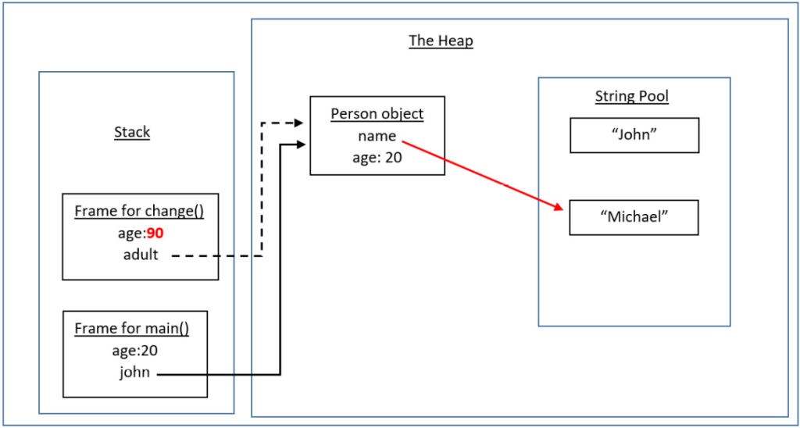
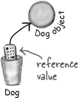

[**TÌM HIỂU SÂU VỀ OBJECT**](#tìm-hiểu-sâu-về-object)
- [**TÌM HIỂU SÂU VỀ OBJECT**](#tìm-hiểu-sâu-về-object)
  - [**I/ Object là gì?**](#i-object-là-gì)
  - [**II/ Object được lưu thế nào trong Java?**](#ii-object-được-lưu-thế-nào-trong-java)
  - [**III/ Wrapper class**](#iii-wrapper-class)
  - [**III/Auto boxing / Auto unboxing**](#iiiauto-boxing--auto-unboxing)
  - [**IV/String và StringBuilder trong Java**](#ivstring-và-stringbuilder-trong-java)
    - [**1/String**](#1string)
    - [**2/ StringBuilder**](#2-stringbuilder)
      - [**a/ Các Constructor quan trọng của lớp StringBuilder trong java**](#a-các-constructor-quan-trọng-của-lớp-stringbuilder-trong-java)
      - [**b/ Các phương thức của lớp StringBuilder trong java**](#b-các-phương-thức-của-lớp-stringbuilder-trong-java)
  - [**V/ Equals và hashcode, toán tử ==**](#v-equals-và-hashcode-toán-tử-)
    - [**1/ Equals**](#1-equals)
    - [**2/ Toán tử ==**](#2-toán-tử-)
    - [**3/ Hashcode**](#3-hashcode)
  - [**VI/ Cách Java truyền tham số, pass by value, tại sao pass-by-value mà String lại thay đổi được?**](#vi-cách-java-truyền-tham-số-pass-by-value-tại-sao-pass-by-value-mà-string-lại-thay-đổi-được)
    - [**1/ Pass-by-value**](#1-pass-by-value)
    - [**2/ Tại sao pass-by-value mà String lại thay đổi được?**](#2-tại-sao-pass-by-value-mà-string-lại-thay-đổi-được)
  - [**VII/ Các khái niệm cơ bản về Garbage Collector**](#vii-các-khái-niệm-cơ-bản-về-garbage-collector)
    - [**1/ Ưu điểm của Garbage Collection**](#1-ưu-điểm-của-garbage-collection)
    - [**2/ Làm thế nào có thể một đối tượng không được tham chiếu?**](#2-làm-thế-nào-có-thể-một-đối-tượng-không-được-tham-chiếu)
    - [**3/ Phương thức finalize()**](#3-phương-thức-finalize)
    - [**4/ Phương thức gc()**](#4-phương-thức-gc)

# **TÌM HIỂU SÂU VỀ OBJECT**

## **I/ Object là gì?**

- Trong Java, object là một thực thể của một lớp (class). Nó được tạo ra từ class và đại diện cho một instance cụ thể của class đó. Mỗi object có các thuộc tính (properties) và phương thức (methods) được xác định bởi class của nó. Nói cách khác, object là một sự triển khai cụ thể của một class, chứa các dữ liệu và các hành vi mà class đã định nghĩa.
- Trong Java, mọi thứ đều là đối tượng (Object). Vậy nên các kiểu dữ liệu nguyên thuỷ cũng là đối tượng.

## **II/ Object được lưu thế nào trong Java?**
-  Để khai báo một đối tượng thuộc lớp, ta sử dụng cú pháp:

> <Tên lớp> <Tên đối tượng>;

Ví dụ: 
```java
Bicycle sportsBicycle;
BankAccount acc;
```

- Chúng ta sử dụng toán tử new và gọi đến hàm khởi tạo (constructor) của lớp để khởi tạo đối tượng. Hàm constructor có tên trùng với tên của lớp.

```java
sportsBicycle = new Bicycle();
acc = new BankAccount();
```
- Khi tạo ra 1 object, ta chỉ lưu 1 địa chỉ tới object đó. Và từ địa chỉ này, ta có thể ra lệnh từ xa để lấy các thuộc tính, phương thức của object đó. Vậy nên, khi ta gán 1 object cho 1 biến, thực chất ta đang gán 1 địa chỉ tới object đó cho biến đó. Vậy nên ta không thể so sánh 2 object với nhau bằng toán tử ``==``, mà phải dùng phương thức ``equals()``.

- Khi khởi tạo, đối tượng được cấp phát một vùng nhớ riêng để lưu trữ các dữ liệu của đối tượng đó. Vùng nhớ lưu trữ các đối tượng là vùng nhớ heap.

- Vùng nhớ Heap là vùng nhớ được sử dụng trong khi đang chạy chương trình (runtime). Vùng nhớ heap giúp lưu trữ tất các đối tượng (object) và mảng (array) được tạo ra với từ khóa new trong Java. Dung lượng sử dụng của heap sẽ tăng giảm phụ thuộc vào các object được tạo ra. Thời gian tồn tại của object phụ thuộc vào Garbage Collector (GC) của Java. Khi một object bị null hoặc không còn được sử dụng thì GC sẽ xóa object khỏi bộ nhớ.

## **III/ Wrapper class**

- Wrapper class trong Java là các class giúp “đóng gói” các dữ liệu thuộc kiểu dữ liệu nguyên thủy trong Java thành một đối tượng, để có thể sử dụng các phương thức phong phú đã được chuẩn bị sẵn trong class với các dữ liệu đó.

- Có 8 wrapper class tương ứng với 8 kiểu dữ liệu nguyên thủy trong Java như sau:

|Kiểu nguyên thủy|Wrapper class|
|---|---|
|boolean|Boolean|
|char|Character|
|byte|Byte|
|short|Short|
|int|Integer|
|long|Long|
|float|Float|
|double|Double|

- Để có thể dùng các phương thức được chuẩn bị sẵn trong wrapper class cho một giá trị thuộc kiểu nguyên thủy, trước hết chúng ta cần phải tạo ra một đối tượng từ wrapper class để chứa giá trị đó.

- Để tạo ra đối tượng từ wrapper class **(boxing)** trong Java, chúng ta sử dụng tới phương thức thành viên valueOf() trong các class wrapper, với cú pháp sau đây:

>WrapperClassName name = WrapperClassName.valueOf(value);

- Ví dụ:
```java
Integer i = Integer.valueOf(8);
Long l = Long.valueOf(8L);
Double d = Double.valueOf(8.1);
Float f = Float.valueOf(8.1F);
```
- Sau khi đã gán giá trị nguyên thủy vào đối tượng của wrapper class tương ứng, chúng ta có thể lấy ra giá trị **(unboxing)** này nhiều lần trong chương trình Java, thông qua các phương thức tương ứng trong các class.

- Ví dụ với wrapper class Integer, chúng ta có thể sử dụng tới phương thức intValue() để lấy ra giá trị được gán với cú pháp sau đây:

```java
i.intValue();
//i là tên của đối tượng được tạo ra từ wrapper class Integer chứa giá trị cần lấy.
```

## **III/Auto boxing / Auto unboxing**
- Auto-boxing là quá trình chuyển đổi từ kiểu dữ liệu nguyên thuỷ sang kiểu dữ liệu lưu dạng object.
- Auto-unboxing là quá trình chuyển đổi từ kiểu dữ liệu lưu dạng object sang kiểu dữ liệu nguyên thuỷ.

```java
Integer i = 8;
```

- Ngoài việc sử dụng trong khai báo, thì autoboxing cũng được sử dụng trong việc lấy dữ liệu đã được gán vào đối tượng. Ví dụ, theo cách thông thường chúng ta sẽ lấy giá trị int đã được gán vào đối tượng của wrapper class Integer như sau:

```java
Integer i = 8;
int val = i;
```
- Tuy nhiên, khi sử dụng Auto-boxing và Auto-unboxing, cần phải cẩn thận, vì nó có thể gây ra lỗi. 
```java
Integer a = null;
int b = a; //NullPointerException
```
- Vậy nên, khi sử dụng Auto-boxing và Auto-unboxing,  cần phải kiểm tra giá trị null trước khi sử dụng.
## **IV/String và StringBuilder trong Java**

### **1/String**

- String là một class trong Java, nó được sử dụng để lưu trữ một chuỗi các ký tự. Một đối tượng String được tạo ra bằng cách sử dụng từ khóa new và có thể được khởi tạo bằng một chuỗi ký tự hoặc một đối tượng String khác.
- Lí do là vì, khi ta tạo biến String mới, ta chỉ đang tạo 1 tham chiếu đến vùng nhớ của String đó.
- String là một dạng immutable, tức là nó không thể thay đổi được. Vì vậy, khi ta thay đổi giá trị của String, ta đang tạo ra một String mới, và tham chiếu đến nó.
```java
String str = "Hello";

str = "World";

```
- Để nhập vào String từ bàn phím, ta sử dụng hàm ``nextLine()`` của Scanner.
- Có 2 cách để tạo đối tượng String:

    + Sử dụng string literal: Mỗi khi bạo tạo một biến string literal, đầu tiên JVM sẽ kiểm tra xem giá trị đó đã tồn tại trong Pool chưa. Nếu chuỗi này đã tồn tại trong Pool, thì giá trị của biến sẽ được tham chiếu đến instance đã được tạo ra trong Pool. Nếu chuỗi này không tồn tại trong Pool, một instance mới được tạo ra và đặt vào trong Pool. Ví dụ:

    ```java
    String s1 = "welcome";  
    String s2 = "welcome"; // se khong tao instance moi
    ```

    +  Sử dụng từ khóa new: Trong trường hợp này, JVM sẽ tạo ra một đối tượng string mới như một đối tượng trong bộ nhớ HEAP và chữ "Welcome" sẽ được đặt trong Pool. Biến s sẽ tham chiếu tối đối tượng được tạo ra trong HEAP.

- Các phương thức:

|Phương thức|Mô tả|
|---|---|
|char charAt(int index)|Trả về giá trị char cho chỉ số cụ thể.|
|int length()|Trả về độ dài chuỗi.|
|static String format(String format, Object... args)|Trả về chuỗi được format.|
|static String format(Locale l, String format, Object... args)|Trả về chuỗi được format theo vùng miền(quốc gia).|
|String substring(int beginIndex)|Trả về chuỗi con bắt đầu từ chỉ số index.|
|String substring(int beginIndex, int endIndex)|Trả về chuỗi con từ chỉ số bắt đầu đến chỉ số kết thúc.|
|boolean contains(CharSequence s)|Kiểm tra chuỗi chứa chuối không, kết quả trả về là giá trị boolean.|
|static String join(CharSequence delimiter, CharSequence... elements)|Trả về chuỗi được nối từ nhiều chuỗi.|
|static String join(CharSequence delimiter, Iterable<? extends CharSequence> elements)|Trả về chuỗi được nối từ nhiều chuỗi.|
|boolean equals(Object another)|kiểm tra sự tương đương của chuỗi với đối tượng.|
|boolean isEmpty()|Kiểm tra chuỗi rỗng.|
|String concat(String str)|Nối chuỗi cụ thể.|
|String replace(char old, char new)|Thay thế tất cả giá trị char cụ thể bằng một giá trị char mới.|
|String replace(CharSequence old, CharSequence new)|Thay thế tất cả các chuỗi bằng một chuỗi mới.|
|static String equalsIgnoreCase(String another)|So sanh chuỗi, không phân biệt chữ hoa hay chữ thường.|
|String[] split(String regex)|Trả về mảng các chuỗi được tách ra theo giá trị regex.|
|String[] split(String regex, int limit)|Trả về mảng các chuỗi được tách ra theo giá trị regex và có giới hạn.|
|String intern()|Trả về chuỗi interned.|
|int indexOf(int ch)|Trả về vị trí của ký tự ch cụ thể.|
|int indexOf(int ch, int fromIndex)|Trả về vị trí của ký tự ch tính từ từ vị trí fromIndex.|
|int indexOf(String substring)|Trả về vị trí của chuỗi con substring.|
|int indexOf(String substring, int fromIndex)|Trả về chuỗi con bắt đầu từ vị trí substring đến vị trí fromIndex.|
|String toLowerCase()|Trả về chuỗi chữ thường.|
|String toLowerCase(Locale l)|Trả về chuỗi chữ thường bằng việc sử dụng locale cụ thể.|
|String toUpperCase()|Trả về chuỗi chữ hoa.|
|String toUpperCase(Locale l)|Trả về chuỗi chữ hoa bằng việc sử dụng locale cụ thể.|
|String trim()|Xóa khoảng trẳng ở đầu và cuối của chuỗi.|
|static String valueOf(int value)|Chuyển đổi giá trị kiểu dữ liệu đã cho thành chuỗi.|

### **2/ StringBuilder**

- Trong java, lớp StringBuilder được sử dụng để tạo chuỗi có thể thay đổi (mutable). Lớp StringBuilder trong java tương tự như lớp StringBuffer ngoại trừ nó không đồng bộ(non-synchronized) tức là luồng không an toàn. Điều này có nghĩa là có 2 luồng cùng truy cập phương thức của lớp StringBuilder đồng thời.

#### **a/ Các Constructor quan trọng của lớp StringBuilder trong java**
- StringBuilder(): Tạo ra một Builder chuỗi với dung lượng ban đầu là 16.

- StringBuilder(String str): Tạo ra một Builder chuỗi với chuỗi cụ thể.

- StringBuilder(int capacity): Tạo ra một Builder chuỗi với dung lượng được chỉ định như độ dài chuỗi.

#### **b/ Các phương thức của lớp StringBuilder trong java**

- public StringBuilder append(String s): được sử dụng để nối thêm các chuỗi được chỉ định với chuỗi này. Các phương thức append() được nạp chồng như append(char), append(boolean), append(int), append(float), append(double), ...

```java
public class StringBuilderExam1 {
    public static void main(String args[]) {
        StringBuilder sb = new StringBuilder("Hello ");
        sb.append("Java");//đến đây chuỗi ban đầu đã bị thay đổi
        System.out.println(sb);//in Hello Java  
    }
}
```

- public StringBuilder insert(int offset, String s): được sử dụng để chèn chuỗi chỉ định với chuỗi này tại vị trí quy định. Các phương thức insert() được nạp chồng như insert(int, char), insert(int, boolean), insert(int, int), insert(int, float), insert(int, double), ...

```java
public class StringBuilderExam2 {
    public static void main(String args[]) {
        StringBuilder sb = new StringBuilder("Hello ");
        sb.insert(1, "Java");//đến đây chuỗi ban đầu đã bị thay đổi
        System.out.println(sb);//in -> HJavaello  
    }
}
```

- public StringBuilder replace(int startIndex, int endIndex, String str): được sử dụng để thay thế chuỗi từ vị trị startIndex đến endIndex bằng chuỗi str.

```java
public class StringBuilderExam3 {
    public static void main(String args[]) {
        StringBuilder sb = new StringBuilder("Hello");
        sb.replace(1, 3, "Java");
        System.out.println(sb);//in -> HJavalo  
    }
}
```

- public StringBuilder delete(int startIndex, int endIndex): được sử dụng để xóa chuỗi từ vị trí startIndex đến endIndex.

```java
public class StringBuilderExam4 {
    public static void main(String args[]) {
        StringBuilder sb = new StringBuilder("Hello");
        sb.delete(1, 3);
        System.out.println(sb);//in -> Hlo  
    }
}
```

- public StringBuilder reverse(): được sử dụng để đảo ngược chuỗi.

```java
public class StringBuilderExam5 {
    public static void main(String args[]) {
        StringBuilder sb = new StringBuilder("Hello");
        sb.reverse();
        System.out.println(sb);//in -> olleH  
    }
}
```

- public int capacity(): được sử dụng để trả về dung lượng hiện tại.

```java
public class StringBuilderExam6 {
    public static void main(String args[]) {
        StringBuilder sb = new StringBuilder();
        System.out.println(sb.capacity());//mặc định là 16  
        sb.append("Hello");
        System.out.println(sb.capacity());//đến đây vẫn là 16  
        sb.append("java is my favourite language");
        System.out.println(sb.capacity());//đến đây là (16*2)+2=34 i.e (dung lượng cũ*2)+2  
    }
}
```

- public void ensureCapacity(int minimumCapacity): được sử dụng để đảm bảo dung lượng ít nhất bằng mức tối thiểu nhất định.

```java
public class StringBuilderExam7 {
    public static void main(String args[]) {
        StringBuilder sb = new StringBuilder();
        System.out.println(sb.capacity());//mặc định là 16  
        sb.append("Hello");
        System.out.println(sb.capacity());//đến đây là 16  
        sb.append("java is my favourite language");
        System.out.println(sb.capacity());//đến đây là (16*2)+2=34 i.e (dung lượng cũ*2)+2  
        sb.ensureCapacity(10);//đến đây không có sự thay đổi
        System.out.println(sb.capacity());//đến đây là 34  
        sb.ensureCapacity(50);//đến đây là (34*2)+2  
        System.out.println(sb.capacity());//đến đây là 70  
    }
}
```

- public char charAt(int index): được sử dụng trả về ký tự tại vị trí quy định.

- public int length(): được sử dụng trả về chiều dài của chuỗi nghĩa là tổng số ký tự.

- public String substring(int beginIndex): được sử dụng trả về chuỗi con bắt đầu từ vị trí được chỉ định.

- public String substring(int beginIndex, int endIndex): được sử dụng trả về chuỗi con với vị trí bắt đầu và vị trí kết thúc được chỉ định.

## **V/ Equals và hashcode, toán tử ==**

- Trong Java, có 2 cách để so sánh 2 đối tượng với nhau, đó là so sánh bằng toán tử ``==`` và so sánh bằng hàm ``equal()``. Tuy nhiên, 2 cách này lại có 2 cách hoạt động khác nhau.
- Khi ta so sánh 2 đối tượng bằng toán tử ``==``, ta đang so sánh 2 địa chỉ của 2 đối tượng đó. Nếu 2 đối tượng đó có cùng địa chỉ, thì toán tử ``==`` sẽ trả về **true**, ngược lại thì trả về **false**.
- Khi ta so sánh 2 đối tượng bằng hàm ``equal()``, ta đang so sánh 2 nội dung của 2 đối tượng đó. Nếu 2 đối tượng đó có cùng nội dung, thì hàm ``equal()`` sẽ trả về **true**, ngược lại thì trả về **false**.
- ``equal()`` dùng để so sánh nội dung của 2 đối tượng. (Lưu ý: toán tử ``==`` sẽ là so sánh giá trị của 2 biến đó, hay chính xác hơn là so sánh địa chỉ, chứ không phải so sánh nội dung)
- ``hashcode()`` dùng để xác định vị trí của đối tượng đó trong một bảng băm (cấu trúc dữ liệu mà đa số sẽ sử dụng)

### **1/ Equals**

- Phương thức equals() so sánh hai chuỗi đưa ra dựa trên nội dung của chuỗi. Nếu hai chuỗi khác nhau nó trả về false. Nếu hai chuỗi bằng nhau nó trả về true.

- Phương thức equals() của lớp String được ghi đè từ phương thức equals() của lớp Object.

```java
public class EqualsExample {
    public static void main(String args[]) {
        String s1 = "java";
        String s2 = "java";
        String s3 = "JAVA";
        String s4 = "python";
        System.out.println(s1.equals(s2)); //true
        System.out.println(s1.equals(s3)); //false
        System.out.println(s1.equals(s4)); //false
    }
}
```

### **2/ Toán tử ==**

- Phương thức equals() được thiết kế để so sánh hai đối tượng về mặt ngữ nghĩa (bằng cách so sánh các thành viên dữ liệu của lớp), trong khi toán tử == so sánh hai đối tượng về mặt kỹ thuật (bằng cách so sánh các tham chiếu của chúng, nghĩa là địa chỉ bộ nhớ).
  
- Ví dụ điển hình so sánh chuỗi trong Java, để thấy sự khác nhau giữa phương thức equal() và toán tử == :

```java
public class EqualExample1 {
    public static void main(String[] args) {
        String s1 = new String("This is a string");
        String s2 = new String("This is a string");
 
        System.out.println("s1 == s2: " + (s1 == s2)); //false
        System.out.println("s1.equals(s2): " + (s1.equals(s2))); //true
    }
}
```

- So sánh tham chiếu (toán tử ==) trả về false vì s1 và s2 là hai đối tượng khác nhau được lưu trữ ở các vị trí khác nhau trong bộ nhớ. Trong khi so sánh ngữ nghĩa trả về true bởi vì s1 và s2 có cùng giá trị (“This is a string”) có thể được coi là bằng nhau về mặt ngữ nghĩa.

### **3/ Hashcode**

- Định nghĩa phương thức hashCode() trong lớp Object:

```java
public native int hashCode();
```

- Phương thức hashCode() trong Java trả về một mã hóa băm (hash code) cho chuỗi này. Hash code cho một đối tượng String được tính toán như sau:

```
s[0]*31^(n-1) + s[1]*31^(n-2) + ... + s[n-1]
```

- Sử dụng thuật toán số học int, với s[i] là ký tự thứ i của chuỗi, n là độ dài chuỗi, và ^ là mũ. (Giá trị hash của chuỗi trống là zero.)

- Số băm này được sử dụng bởi các collection dựa trên bảng băm như Hashtable , HashSet và HashMap để lưu trữ các đối tượng trong các container nhỏ được gọi là "nhóm". Mỗi nhóm được liên kết với mã băm và mỗi nhóm chỉ chứa các đối tượng có mã băm giống hệt nhau.

- Nói cách khác, một bảng băm nhóm các phần tử của nó bằng các giá trị mã băm của chúng. Sự sắp xếp này giúp cho bảng băm định vị một phần tử một cách nhanh chóng và hiệu quả bằng cách tìm kiếm trên các phần nhỏ của collection thay vì toàn bộ collection.

- Dưới đây là các bước để định vị một phần tử trong một bảng băm:

  + Nhận giá trị mã băm của phần tử được chỉ định bằng cách gọi phương thức hashCode().

  + Tìm nhóm thích hợp được liên kết với mã băm đó.

  + Bên trong nhóm, tìm phần tử chính xác bằng cách so sánh phần tử được chỉ định với tất cả các phần tử trong nhóm. Bằng phương thức equals() của phần tử đã chỉ định được gọi.

- Có nói rằng, khi chúng ta thêm các đối tượng của một lớp vào một collection dựa trên bảng băm (HashSet, HashMap ), phương thức hashCode() của lớp được gọi để tạo ra một số nguyên (có thể là một giá trị tùy ý). Con số này được sử dụng bởi bộ sưu tập để lưu trữ và định vị các đối tượng một cách nhanh chóng và hiệu quả, vì collection dựa trên bảng băm không duy trì thứ tự các phần tử của nó.

- Như đã giải thích ở trên, collection dựa trên bảng băm xác định một phần tử bằng cách gọi phương thức hashCode() và equals() của nó, vì vậy khi ghi đè các phương thức này chúng ta phải tuân theo các quy tắc sau:

    + Khi phương thức equals() được ghi đè, phương thức hashCode() cũng phải được ghi đè.

    + Nếu hai đối tượng bằng nhau, mã băm của chúng phải bằng nhau.

    + Nếu hai đối tượng không bằng nhau, không có ràng buộc về mã băm của chúng (mã băm của chúng có thể bằng nhau hay không).

    + Nếu hai đối tượng có mã băm giống nhau, thì không có ràng buộc nào về sự bình nhau của chúng (chúng có thể bằng nhau hay không).

    + Nếu hai đối tượng có mã băm khác nhau, chúng không được bằng nhau.

    + Nếu chúng ta vi phạm các quy tắc này, các collection sẽ hoạt động có thể không đúng như các đối tượng không thể tìm thấy, hoặc các đối tượng sai được trả về thay vì các đối tượng chính xác.

## **VI/ Cách Java truyền tham số, pass by value, tại sao pass-by-value mà String lại thay đổi được?**

- Trong Java, khi ta truyền tham số vào một phương thức (method), Java sử dụng cách truyền theo giá trị (pass by value). Điều này có nghĩa là Java tạo một bản sao của giá trị và truyền bản sao đó vào phương thức, chứ không phải tham chiếu đến đối tượng gốc.

- Trong Java, có 2 cách để truyền tham số cho phương thức:

    + Tham trị (pass by value)

    + Tham chiếu (pass by reference)

### **1/ Pass-by-value**

- Trong Java, khi ta truyền tham số vào một hàm, thì tham số đó sẽ được copy ra một vùng nhớ khác, và hàm sẽ thao tác với tham số ở vùng nhớ mới này.
- Vậy nên, khi ta thay đổi giá trị của tham số trong hàm, thì giá trị của tham số bên ngoài hàm không bị thay đổi.

```java
public class Main {
  public static void main(String[] args) {
    int a = 1;
    System.out.println(a); // 1
    change(a);
    System.out.println(a); // 1
  }

  public static void change(int a) {
    a = 2;
  }
}
```

- Tuy nhiên, nó sẽ lại thay đổi được các thuộc tính của object.
```java
public class Main {
  public static void main(String[] args) {
    Student student = new Student();
    student.name = "A";
    System.out.println(student.name); // A
    change(student);
    System.out.println(student.name); // B
  }

  public static void change(Student student) {
    student.name = "B";
  }
}

class Student {
  String name;
}
```
### **2/ Tại sao pass-by-value mà String lại thay đổi được?**



- Ta hãy quay trở lại khái niệm vừa nhắc tới Khi ta truyền một biến nguyên thuỷ, hay trong trường hợp trên là age, ta đang như tạo một bản sao của một tờ giấy bình thường, tờ giấy đó ghi số là 20, ta đưa cho người khác. Họ sửa chúng thành 90, 100 hay gì đi chăng nữa, thì tờ giấy ban đầu của ta vẫn là 20

- Tuy nhiên, khi ta truyền một biến reference (tham chiếu) của Object person, ta đang truyền bản sao của “tham chiếu” của nó. Hay đơn giản là, ta đang tạo ra bản sao của một cái điều khiển, vậy thì cái điều khiển bản sao này khi đưa cho người khác, vẫn sẽ bật tắt được tivi ban đầu của mình.

## **VII/ Các khái niệm cơ bản về Garbage Collector**



- Trong quá trình thực thi chương trình, Java sẽ liên tục tìm các Object không được tham chiếu tới Heap Memory (mang giá trị null hoặc một vài trường hợp khác). Sau đó Garbage Collector sẽ tự động giải phóng bộ nhớ cho các ô nhớ chứa tham chiếu đó.

- Để làm như vậy, chúng ta đã sử dụng hàm free() trong ngôn ngữ C và delete() trong C ++. Nhưng, trong java nó được thực hiện tự động. Vì vậy, java cung cấp việc quản lý bộ nhớ tốt hơn.

### **1/ Ưu điểm của Garbage Collection**

- Nó làm cho việc sử dụng bộ nhớ java hiệu quả bởi vì bộ thu gom rác (Garbage Collection) loại bỏ các đối tượng không được tham chiếu từ bộ nhớ heap.

- Nó được được thực hiện tự động bởi trình thu gom rác (một phần của JVM) vì vậy chúng ta không cần phải nỗ lực nhiều để giải phóng bộ nhớ.

### **2/ Làm thế nào có thể một đối tượng không được tham chiếu?**

- Bởi gán giá trị null.

```java
Employee e=new Employee();
e=null;
```

- Bởi việc gán đối tượng đến một tham chiếu khác.

```java
Employee e1=new Employee();
Employee e2=new Employee();
e1=e2;
```

- Bởi một đối tượng annonymous.

```java
new Employee(); 
```

### **3/ Phương thức finalize()**

- Phương thức finalize() được gọi mỗi lần trước khi đối tượng được thu gom rác. Phương thức này có thể được sử dụng để thực hiện xử lý dọn dẹp. Phương thức này được định nghĩa trong lớp Object như sau:

```java
protected void finalize(){}
```

> Ghi chú: Garbage Collection của JVM chỉ thu thập các đối tượng được tạo ra bởi từ khoá new. Vì vậy, nếu bạn đã tạo ra bất kỳ đối tượng nào mà không có new, bạn có thể sử dụng phương thức finalize() để thực hiện quá trình xử lý dọn dẹp (phá hủy các đối tượng còn lại).

### **4/ Phương thức gc()**

- Phương thức gc () được sử dụng để gọi bộ thu gom rác để thực hiện quá trình dọn dẹp. Phương thức gc() được cài đặt trong các lớp System và Runtime.

> Ghi chú: Garbage Collection được thực hiện bởi một luồng hiểm gọi là Garbage Collector (GC). Luồng này gọi phương thức finalize() trước khi đối tượng thu gom rác.