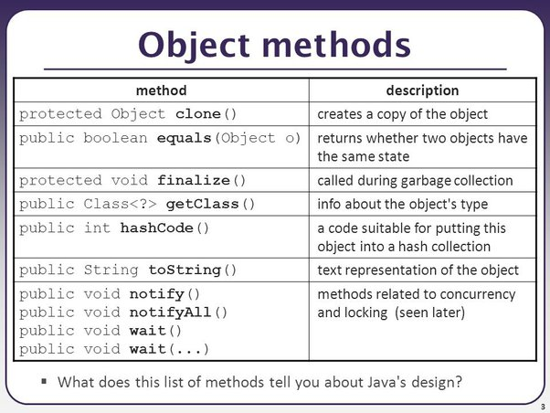
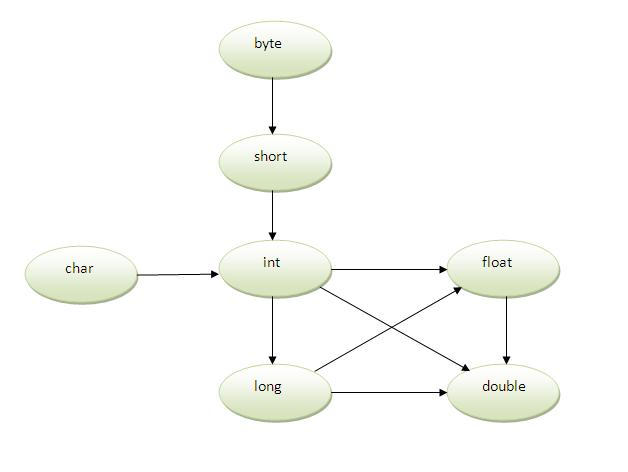

- [**MỌI THỨ ĐỀU LÀ ĐỐI TƯỢNG**](#mọi-thứ-đều-là-đối-tượng)
  - [**I. Tính đóng gói**](#i-tính-đóng-gói)
  - [II. Tính kế thừa (đặc điểm, constructor, variable hiding, đa kế thừa, ...) ?](#ii-tính-kế-thừa-đặc-điểm-constructor-variable-hiding-đa-kế-thừa--)
    - [**1. Đặc điểm:**](#1-đặc-điểm)
    - [**2. Các kiểu kế thừa trong Java:**](#2-các-kiểu-kế-thừa-trong-java)
    - [**3. Constructor:**](#3-constructor)
    - [**4. Variable Hiding:**](#4-variable-hiding)
    - [**5. Đa kế thừa:**](#5-đa-kế-thừa)
  - [**III. Upcasting và Downcasting**](#iii-upcasting-và-downcasting)
    - [1. Upcasting](#1-upcasting)
    - [2. Downcasting](#2-downcasting)
  - [**IV. Class Object**](#iv-class-object)
  - [**V. Tính đa hình**](#v-tính-đa-hình)
  - [**VI. Phân biệt Overload và Override.**](#vi-phân-biệt-overload-và-override)
    - [1. Overload](#1-overload)
    - [2. Override](#2-override)
    - [3. Phân biệt Overload và Override](#3-phân-biệt-overload-và-override)
  - [**VII. Đa hình compile time và runtime**](#vii-đa-hình-compile-time-và-runtime)
    - [1. Đa hình Runtime](#1-đa-hình-runtime)
    - [2. Đa hình compile time](#2-đa-hình-compile-time)

# **MỌI THỨ ĐỀU LÀ ĐỐI TƯỢNG**
## **I. Tính đóng gói**
- Tính đóng gói trong là một trong 4 tính chất quan trọng của lập trình hướng đối tượng, đóng gói cho phép chúng ta ẩn thông tin và bảo vệ các thành phần của chương trình khỏi sự can thiệp từ bên ngoài. Điều này được thực hiện thông qua việc sử dụng các phạm vi truy cập như public, private và protected để kiểm soát quyền truy cập đến các thành phần của class.
- Lợi ích của tính đóng gói:
    + Đóng gói giúp che dấu thông tin bên trong của một đối tượng, chỉ cho phép các đối tượng khác tương tác thông qua các phương thức được cung cấp.
    + Đóng gói giúp giảm sự phức tạp của chương trình, giúp dễ dàng bảo trì và mở rộng chương trình.
    + Ngoài ra, đóng gói giúp ta đảm bảo việc dữ liệu sẽ được giấu khỏi các đối tượng khác, và chỉ có các phương thức được cung cấp mới có thể tương tác với dữ liệu đó. Giúp đảm bảo tính toàn vẹn của dữ liệu.
- Các quy tắc và nguyên tắc của tính năng đóng gói trong Java:
    + **Đặt các trường dữ liệu là private:** Điều này giúp đảm bảo rằng các trường dữ liệu chỉ có thể được truy cập thông qua các phương thức công khai, giúp tăng tính nhất quán và bảo mật của mã nguồn.
    + **Sử dụng các phương thức công khai để truy cập và thay đổi các trường dữ liệu:** Việc sử dụng các phương thức công khai giúp kiểm soát quyền truy cập vào các trường dữ liệu và đảm bảo tính nhất quán của dữ liệu.
    + **Không sử dụng từ khóa public cho các trường dữ liệu:** Việc sử dụng từ khóa public cho các trường dữ liệu có thể dẫn đến việc truy cập trực tiếp vào các trường này từ bên ngoài lớp, gây ra rủi ro về tính nhất quán và bảo mật của mã nguồn.
    + **Sử dụng từ khóa final cho các trường dữ liệu không thay đổi:** Việc sử dụng từ khóa final giúp đảm bảo rằng các trường dữ liệu không thể bị thay đổi, giúp tăng tính nhất quán và an toàn của mã nguồn.
- **Ví dụ:** Hãy xem xét một ví dụ phức tạp hơn về tính đóng gói trong Java, liên quan đến một hệ thống quản lý trường học với các class như ``School``, ``Teacher``, ``Student`` và ``Course``.

```java
import java.util.ArrayList;
import java.util.List;

// Class mô phỏng thông tin về một giáo viên
class Teacher {
    private String name;
    private String subject;

    public Teacher(String name, String subject) {
        this.name = name;
        this.subject = subject;
    }

    public String getName() {
        return name;
    }

    public String getSubject() {
        return subject;
    }
}

// Class mô phỏng thông tin về một học sinh
class Student {
    private String name;
    private int grade;

    public Student(String name, int grade) {
        this.name = name;
        this.grade = grade;
    }

    public String getName() {
        return name;
    }

    public int getGrade() {
        return grade;
    }
}

// Class mô phỏng thông tin về một khóa học
class Course {
    private String courseName;
    private List<Student> studentsEnrolled;

    public Course(String courseName) {
        this.courseName = courseName;
        this.studentsEnrolled = new ArrayList<>();
    }

    public void enrollStudent(Student student) {
        studentsEnrolled.add(student);
    }

    public void displayEnrolledStudents() {
        System.out.println("Danh sách học sinh đã đăng ký khóa học " + courseName + ":");
        for (Student student : studentsEnrolled) {
            System.out.println("Tên: " + student.getName() + ", Điểm: " + student.getGrade());
        }
    }
}

// Class đại diện cho trường học, quản lý thông tin giáo viên và khóa học
class School {
    private List<Teacher> teachers;
    private List<Course> courses;

    public School() {
        this.teachers = new ArrayList<>();
        this.courses = new ArrayList<>();
    }

    public void addTeacher(Teacher teacher) {
        teachers.add(teacher);
    }

    public void addCourse(Course course) {
        courses.add(course);
    }

    public void displayTeachers() {
        System.out.println("Danh sách giáo viên trong trường:");
        for (Teacher teacher : teachers) {
            System.out.println("Tên: " + teacher.getName() + ", Môn: " + teacher.getSubject());
        }
    }

    public void displayCourses() {
        System.out.println("Danh sách các khóa học trong trường:");
        for (Course course : courses) {
            System.out.println("Khóa học: " + course.courseName);
            course.displayEnrolledStudents();
        }
    }
}
```
Trong ví dụ này, chúng ta có các class ``Teacher``,`` Student``, và ``Course`` để quản lý thông tin về giáo viên, học sinh và các khóa học. Class ``School`` đóng gói thông tin về giáo viên và các khóa học trong trường.

Mỗi class có các phương thức để truy xuất và quản lý thông tin, như ``displayEnrolledStudents()`` trong class ``Course`` để hiển thị danh sách học sinh đăng ký khóa học, hoặc ``displayTeachers()`` trong class ``School`` để hiển thị danh sách giáo viên trong trường.

Tính đóng gói ở đây giúp tổ chức chặt chẽ thông tin và chức năng của mỗi thành phần, tạo ra một cấu trúc mô-đun và dễ bảo trì trong hệ thống quản lý trường học.

## II. Tính kế thừa (đặc điểm, constructor, variable hiding, đa kế thừa, ...) ?
### **1. Đặc điểm:**
- **Kế thừa trong java** là sự liên quan giữa hai class với nhau, trong đó có class cha **(superclass)** và class con **(subclass)**.

- Class con được hưởng tất cả phương thức và thuộc tính của cha. Nhưng ***chỉ truy cập vào public và protected*** của class cha, không được truy cập đến private của cha.

- Cú pháp kế thừa:
```java
class Subclass-name extends Superclass-name {  
   //methods and fields
}
```

- Ví dụ kế thừa:
```java
// Lớp cha Person
class Person {
    String name = "John";

    void displayName() {
        System.out.println("Name: " + name);
    }
}

// Lớp con Student kế thừa từ Person
class Student extends Person {
    int grade = 10;

    void displayGrade() {
        System.out.println("Grade: " + grade);
    }
}

// Lớp chính để kiểm tra kế thừa
public class InheritanceExample3 {
    public static void main(String args[]) {
        Student student = new Student();
        student.displayName();  // Gọi phương thức từ lớp cha
        student.displayGrade(); // Gọi phương thức từ lớp con
    }
}
```
### **2. Các kiểu kế thừa trong Java:**

- Đơn kế thừa:
```java
// Lớp cha Animal
class Animal {
    void eat() {
        System.out.println("Animal is eating");
    }
}

// Lớp con Dog kế thừa lớp Animal
class Dog extends Animal {
    void bark() {
        System.out.println("Dog is barking");
    }
}

// Lớp chính để kiểm tra kế thừa
public class InheritanceExample {
    public static void main(String args[]) {
        Dog d = new Dog();
        d.eat();  // Gọi phương thức của lớp cha
        d.bark(); // Gọi phương thức của lớp con
    }
}
```

- Kế thừa nhiều tầng:
```java
class Animal {
    void eat() {
        System.out.println("eating...");
    }
}
 
class Dog extends Animal {
    void bark() {
        System.out.println("barking...");
    }
}
 
class BabyDog extends Dog {
    void weep() {
        System.out.println("weeping...");
    }
}
 
public class TestInheritance2 {
    public static void main(String args[]) {
        BabyDog d = new BabyDog();
        d.weep();
        d.bark();
        d.eat();
    }
}
```

- Kế thừa thứ bậc:
```java
class Animal {
    void eat() {
        System.out.println("eating...");
    }
}
 
class Dog extends Animal {
    void bark() {
        System.out.println("barking...");
    }
}
 
class Cat extends Animal {
    void meow() {
        System.out.println("meowing...");
    }
}
 
public class TestInheritance3 {
    public static void main(String args[]) {
        Cat c = new Cat();
        c.meow();
        c.eat();
        // c.bark(); // compile error
    }
}
```

### **3. Constructor:**
- **Constructor** dùng để khởi tạo giá trị ban đầu cho các thuộc tính của đối tượng. 
- Khi có tính kế thừa, các lớp con sẽ kế thừa tất cả thuộc tính và phương thức từ lớp cha, *nhưng constructor không được kế thừa*. 
- Để lớp con gọi constructor từ lớp cha thì cần dùng từ khóa `super()`
```java
// Lớp cha Person
class Person {
    String name;

    // Constructor của lớp cha
    Person(String name) {
        this.name = name;
        System.out.println("Person constructor called");
    }
}

// Lớp con Student kế thừa từ Person
class Student extends Person {
    int grade;

    // Constructor của lớp con
    Student(String name, int grade) {
        super(name); // Gọi constructor của lớp cha
        this.grade = grade;
        System.out.println("Student constructor called");
    }
}

// Lớp chính để kiểm tra constructor trong kế thừa
public class InheritanceConstructorExample {
    public static void main(String args[]) {
        Student student = new Student("Alice", 10);
    }
}
```
- **Giải thích**:
    + Constructor của lớp `Person`: Constructor này nhận một tham số `name` và gán giá trị đó cho thuộc tính `name`. Khi constructor này được gọi, nó sẽ in ra "Person constructor called".
    + Constructor của lớp `Student`: Constructor này nhận hai tham số, `name` và `grade`. Nó gọi `super(name)` để sử dụng constructor của lớp cha `Person` nhằm khởi tạo thuộc tính `name`. Sau đó, nó gán giá trị cho `grade` và in ra "Student constructor called".

### **4. Variable Hiding:**
**Variable Hiding** trong Java xảy ra khi một lớp con có một biến (thuộc tính) cùng tên với biến trong lớp cha. Khi điều này xảy ra, biến của lớp con sẽ *ẩn* (hide) biến của lớp cha trong ngữ cảnh của lớp con.

Điều này khác với phương thức vì **Java không hỗ trợ ghi đè (override) biến**. Khi một biến được *ẩn* trong lớp con, truy cập vào biến đó sẽ phụ thuộc vào kiểu của tham chiếu

```java
// Lớp cha
class Person {
    String name = "John";
}

// Lớp con
class Student extends Person {
    String name = "Alice"; // Biến này sẽ "ẩn" biến name của lớp cha

    void displayNames() {
        System.out.println("Name in Student class: " + name);        // Truy cập biến `name` của lớp con
        System.out.println("Name in Person class: " + super.name);   // Truy cập biến `name` của lớp cha
    }
}

// Lớp chính để kiểm tra variable hiding
public class VariableHidingExample {
    public static void main(String args[]) {
        Student student = new Student();
        student.displayNames();
    }
}
```
### **5. Đa kế thừa:**
`Tính đa kế thừa không được hỗ trợ trong Java vì để giảm thiểu sự phức tạp và đơn giản hóa ngôn ngữ`

Giả sử có 3 lớp: A, B, C. Nếu C kế thừa từ A và B (A, B có các phương thức giống nhau) thì sẽ khó xác định được việc gọi phương thức của lớp A hay B.

Vì vậy lỗi khi biên dịch sẽ tốt hơn lỗi khi runtime, java sẽ print ra lỗi "compile time error" nếu bạn cố tình kế thừa 2 class.

```java
class A {
    void msg() {
        System.out.println("Hello");
    }
}
 
class B {
    void msg() {
        System.out.println("Welcome");
    }
}
 
public class C extends A,B { 
 public static void main(String args[]) {
        C obj = new C();
        obj.msg();
    }
}
```
**OUTPUT**
`Compile Time Error`
## **III. Upcasting và Downcasting**
### 1. Upcasting
- Khi biến tham chiếu của lớp cha tham chiếu tới đối tượng của lớp con, thì đó là Upcasting.
- **Ví dụ:** Hàm main dưới đây thực hiện upcasting khi gán đối tượng cat thuộc lớp Cat cho đối tượng animal1 và animal2 thuộc lớp Animal.
```java
public class Upcasting {
 
    public static void main(String[] args) {
        Cat cat = new Cat();
        Animal animal1 = cat; // Chuyển kiểu không tường minh
        Animal animal2 = (Animal) cat; // Chuyển kiểu tường minh
 
        cat.eat();
        cat.meow();
        animal1.eat();
        animal2.eat();
        // animal2.meow(); // Không thể gọi phương thức meow()
    }
 
}
```
Kết quả khi thực hiện chương trình:
```java
eating...
meowing...
eating...
eating...
```
### 2. Downcasting
- Khác với upcasting, Downcasting là dạng chuyển kiểu chuyển 1 đối tượng là một thể hiện của lớp cha xuống thành đối tượng là thể hiện của lớp con trong quan hệ kế thừa.
- **Ví dụ:** Ta thấy, meow() là phương thức chỉ có ở lớp Cat. Tuy nhiên, thông qua downcasting ta hoàn toàn có thể gọi ra phương thức đó thông qua đối tượng cat mà không cần new Cat() bằng việc downcasting đối tượng animal có kiểu Animal mà không xảy ra vấn đề trong quá trình biên dịch (compile) và thực thi (runtime).
```java
public class Downcating {
 
    public static void main(String[] args) {
        Animal animal = new Cat();
        Cat cat = (Cat) animal; // downcasting
        cat.meow();
    }
 
}
```
- **Lưu ý:** khi thực hiện downcasting có thể sẽ gặp lỗi ClassCastException nếu không thể thực hiện downcassting được. Để an toàn chúng ta nên kiểm tra một đối tượng có phải là thể hiện của một kiểu dữ liệu cụ thể không trước khi thực hiện downcasting
## **IV. Class Object**

- Trong Java, mọi class đều kế thừa từ class Object
- Class Object là class cha của tất cả các class khác
- Class Object có các phương thức như ``equals()``, ``toString()``, ``hashCode()``, ``clone()``, ``finalize()``, ``wait()``, ``notify()``, ``notifyAll()``, …
- Các phương thức này được các class khác kế thừa, và có thể sử dụng lại
- Có nhiều phương thức các bạn chưa cần đào sâu. Tuy nhiên tạm thời có thể để ý nó có các phương thức quan trọng như equals, toString, hashCode. Đây là các phương thức thường được dùng.
## **V. Tính đa hình**
- Tính đa hình (polymorphism) là một trong bốn tính chất cơ bản của lập trình hướng đối tượng trong Java.
- Tính đa hình là khả năng một đối tượng có thể thực hiện một tác vụ theo nhiều cách khác nhau.
- Đa hình giúp ta có thể sử dụng các đối tượng khác nhau, nhưng có cùng một kiểu dữ liệu, giúp giảm sự lặp lại của code, giúp dễ dàng bảo trì và mở rộng chương trình
- Trong Java, chúng ta sử dụng nạp chồng phương thức (method overloading) và ghi đè phương thức (method overriding) để có tính đa hình.
    + Nạp chồng (Overloading): Đây là khả năng cho phép một lớp có nhiều thuộc tính, phương thức cùng tên nhưng với các tham số khác nhau về loại cũng như về số lượng. Khi được gọi, dựa vào tham số truyền vào, phương thức tương ứng sẽ được thực hiện.
    + Ghi đè (Overriding): là hai phương thức cùng tên, cùng tham số, cùng kiểu trả về nhưng thằng con viết lại và dùng theo cách của nó, và xuất hiện ở lớp cha và tiếp tục xuất hiện ở lớp con. Khi dùng override, lúc thực thi, nếu lớp Con không có phương thức riêng, phương thức của lớp Cha sẽ được gọi, ngược lại nếu có, phương thức của lớp Con được gọi.
## **VI. Phân biệt Overload và Override.**
### 1. Overload 
- Overload là một kĩ thuật trong đa hình, giúp ta có thể tạo ra nhiều phương thức cùng tên, nhưng khác nhau về tham số truyền vào
- Overload giúp ta có thể sử dụng các phương thức khác nhau, nhưng có cùng một tên, và khi gọi các phương thức, ta sẽ thấy mỗi phương thức sẽ thực hiện theo cách của nó, chứ không phải cách của phương thức khác
- Có 2 cách nạp chồng phương thức trong java
    + Thay đổi số lượng các tham số
    + Thay đổi kiểu dữ liệu của các tham số
- **Nạp chồng phương thức: thay đổi số lượng các tham số**
**Ví dụ:** tạo 2 phương thức có cùng kiểu dữ liệu: phương thức add() đầu tiên thực hiện việc tính tổng của 2 số, phương thức thứ hai thực hiện việc tính tổng của 3 số.
```java
class Adder {
    static int add(int a, int b) {
        return a + b;
    }
 
    static int add(int a, int b, int c) {
        return a + b + c;
    }
}
 
class TestOverloading1 {
    public static void main(String[] args) {
        System.out.println(Adder.add(5, 5));
        System.out.println(Adder.add(5, 5, 5));
    }
}
```
Đoạn code trên chạy sẽ cho ra kết quả:
```java
10
15
```
- **Nạp chồng phương thức: thay đổi kiểu dữ liệu của các tham số**
**Ví dụ:** tạo 2 phương thức có kiểu dữ liệu khác nhau: phương thức add() đầu tiên nhận 2 đối số có kiểu giá trị là integer, phương thức thứ hai nhận 2 đối số có kiểu giá trị là double.
```java
class Adder {
    static int add(int a, int b) {
        return a + b;
    }

    static double add(double a, double b) {
        return a + b;
    }
}

class TestOverloading2 {
    public static void main(String[] args) {
        System.out.println(Adder.add(5, 5));
        System.out.println(Adder.add(4.3, 5.6));
    }
}
```
Đoạn code trên chạy sẽ cho ra kết quả:
```java
10
9.9
```
- **Một số câu hỏi về nạp chồng phương thức trong java**
    + **Tại sao không thể nạp chồng phương thức bằng cách chỉ thay đổi kiểu trả về của phương thức?** Trong java, không thể nạp chồng phương thức bằng cách chỉ thay đổi kiểu trả về của phương thức bởi vì không biết phương thức nào sẽ được gọi.
    + **Có thể nạp chồng phương thức main() không?** Có, bạn có thể nạp chồng n phương thức main. Nhưng JVM chỉ gọi phương thức main() có tham số truyền vào là một mảng String.
    + VD:
    ```java
        public class TestOverloading4 {
        public static void main(String[] args) {
            System.out.println("main with String[]");
        }
    
        public static void main(String args) {
            System.out.println("main with String");
        }
    
        public static void main() {
            System.out.println("main without args");
        }
    }
    ```
    Đoạn code trên chạy sẽ cho ra kết quả:
    ```java
    main with String[]
    ```
- **Nạp chồng phương thức và tự động ép kiểu**
    +  Kiểu dữ liệu của đối số truyền vào được thay đổi sang kiểu dữ liệu khác (tự động ép kiểu) nếu giá trị của đối số đó không phù hợp với kiểu dữ liệu của tham số đã được đinh nghĩa.
    
    
### 2. Override
- Override là một kĩ thuật trong đa hình, giúp ta có thể thay đổi cách thức hoạt động của một phương thức đã có sẵn trong class cha
- Override giúp ta có thể sử dụng các đối tượng khác nhau, nhưng có cùng một class cha, và khi gọi các phương thức, ta sẽ thấy mỗi đối tượng sẽ thực hiện theo cách của nó, chứ không phải cách của đối tượng khác.
- Ghi đè phương thức trong java xảy ra nếu lớp con có phương thức giống lớp cha. Nguyên tắc ghi đè phương thức:
    + Phương thức phải có tên giống với lớp cha.
    + Phương thức phải có tham số giống với lớp cha.
    + Lớp con và lớp cha có mối quan hệ kế thừa.
- **Ví dụ về ghi đè phương thức**
**Ví dụ:** Giả sử Bank là một đối tượng cung cấp lãi suất. Nhưng lãi suất lại khác nhau giữa từng ngân hàng. Ví dụ, các ngân hàng VCB, AGR và CTG có thể cung cấp các lãi suất lần lượt là 8%, 7% và 9%.
```java
class Bank {
    int getRateOfInterest() {
        return 0;
    }
}
 
class VCB extends Bank {
    int getRateOfInterest() {
        return 8;
    }
}
 
class AGR extends Bank {
    int getRateOfInterest() {
        return 7;
    }
}
 
class CTG extends Bank {
    int getRateOfInterest() {
        return 9;
    }
}
 
class BankApp {
    public static void main(String args[]) {
        VCB s = new VCB();
        AGR i = new AGR();
        CTG a = new CTG();
        System.out.println("VCB Rate of Interest: " + s.getRateOfInterest());
        System.out.println("AGR Rate of Interest: " + i.getRateOfInterest());
        System.out.println("CTG Rate of Interest: " + a.getRateOfInterest());
    }
}
```
Kết quả khi chạy chương trình trên:
```java
VCB Rate of Interest: 8
AGR Rate of Interest: 7
CTG Rate of Interest: 9
```
- **Một số câu hỏi về ghi đè phương thức**
    + **Có ghi đè được phương thức static không?**
    Không, phương thức static không thể ghi đè được, bởi vì ghi đè phương thức được thực thi lúc runtime (tính đa hình).

    + **Tại sao không ghi đè được phương thức static?**
    Vì phương thức static được ràng buộc với class, còn phương thức instance được ràng buộc với đối tượng. Static thuộc về vùng nhớ class còn instance thuộc về vùng nhớ heap.

    + **Có ghi đè phương thức main được không?**Không, vì main là phương thức static.
### 3. Phân biệt Overload và Override 
| **Thuộc tính** | **Overload** | **Override** |
|----------------|--------------|--------------|
| Đặc điểm tên   | Cùng tên, khác tham số | Cùng tên, cùng tham số |
| Phạm vi áp dụng | Cùng class | Khác class |
| Công dụng      | Tạo nhiều phương thức cùng tên với tham số khác nhau | Thay đổi cách thức hoạt động của phương thức có sẵn trong class cha |
| Thời điểm thực thi | Compile time | Run time |

## **VII. Đa hình compile time và runtime**
- Đa hình compile time là đa hình mà chúng ta có thể thấy được ngay trong quá trình code, ví dụ như overload. Đa hình compile time sẽ được thực hiện trong compile time, tức là khi chúng ta build chương trình, chúng ta sẽ thấy các phương thức được overload sẽ được thực hiện theo cách của nó, chứ không phải cách của phương thức khác.
- Đa hình runtime là đa hình mà chúng ta không thể thấy được ngay trong quá trình code, ví dụ như override. Đa hình runtime sẽ được thực hiện trong runtime, tức là khi chúng ta chạy chương trình, chúng ta sẽ thấy các phương thức được override sẽ được thực hiện theo cách của nó, chứ không phải cách của phương thức khác.

**Ví dụ:** Khi viết code lúc compile ta đã thấy ngay phương thức nào được gọi, nhưng khi chạy chương trình, ta mới thấy phương thức nào được thực hiện của override.

### 1. Đa hình Runtime
- Đa hình Runtime (thời điểm chạy) hay đa hình động (dynamic) trong Java là việc gọi phương thức được được ghi đè trong thời gian chạy chương trình.  Điều này có nghĩa là JVM quyết định xem sử dụng cài đặt của phương thức nào dựa trên kiểu thực tế của đối tượng tại thời điểm chạy.xảy ra khi quyết định. Đa hình runtime đạt được thông qua việc ghi đè phương thức (overriding).

- Ở đây, ghi đè được xác định bằng cách sử dụng một biến tham chiếu của lớp cha. Phương thức sẽ được gọi dựa trên đối tượng xác định bởi biến tham chiếu. Điều này còn được gọi là upcasting ( quá trình chuyển đổi kiểu dữ liệu đối tượng từ lớp con sang lớp cha).

- **Lưu ý:** Đa hình Runtime chỉ có thể được đạt được thông qua phương thức ghi đè, không phải thông qua biến do biến tham chiếu đã được xác định tại Compile time và không thẻ thay đổi tại run-time.
- **Ví dụ**: Ở ví dụ dưới đây, chúng ta tạo ra hai đối tượng animal1 và animal2 với kiểu dữ liệu là lớp cha Animal, nhưng thực sự được khởi tạo là đối tượng của lớp con Cat và Dog. Khi gọi phương thức makeSound() trên hai đối tượng này, phương thức được ghi đè trong lớp con sẽ được thực thi.

```java
public class Animal {
    public void makeSound() {

        System.out.println(“Animal is making a sound”);

    }

}

public class Cat extends Animal {

    @Override

    public void makeSound() {

        System.out.println(“Meow!”);

    }

}

public class Dog extends Animal {

    @Override

    public void makeSound() {

        System.out.println(“Woof!”);

    }

}

public class Main {

    public static void main(String[] args) {

        Animal animal1 = new Cat();

        Animal animal2 = new Dog();

        animal1.makeSound(); // Output: “Meow!”

        animal2.makeSound(); // Output: “Woof!”

    }

}
```
### 2. Đa hình compile time
- Đa hình compile time (thời điểm biên dịch) trong Java còn được gọi là đa hình tĩnh (static) vì nó quyết định về phương thức nào sẽ được gọi tại thời điểm biên dịch, dựa trên kiểu của biến tham chiếu được sử dụng để gọi phương thức. Điều này xảy ra khi chúng ta sử dụng các phương thức được định nghĩa ở lớp cha hoặc interface và triển khai lại chúng trong các lớp con. Đa hình biên dịch có thể được đạt được thông qua quá trình nạp chồng phương thức (Method Overloading).
- **Lưu ý:** Ngoài method overloading, tính đa hình nói chung còn có thể đạt được bằng operator overloading. Tuy nhiên, Java không hỗ trợ operator overloading nên chúng ta sẽ không đi sâu về vấn đề này.
- **Ví dụ:** Ở ví dụ dưới, chúng ta có ba phương thức display() có cùng tên nhưng có tham số khác nhau. Tại thời điểm biên dịch, Java sẽ xác định phương thức nào sẽ được gọi dựa trên thông tin về tham số truyền vào.
```java
public class Example {
    public void display(int num) {

        System.out.println(“Number: ” + num);

    }

    public void display(String text) {

        System.out.println(“Text: ” + text);

    }   

    public void display(int num1, int num2) {

        System.out.println(“Numbers: ” + num1 + “, ” + num2);

    }

}
```


