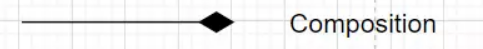

- [**LẬP TRÌNH KHÔNG CHỈ LÀ CODE**](#lập-trình-không-chỉ-là-code)
  - [**I.Version Control là gì và tại sao cần dùng nó?**](#iversion-control-là-gì-và-tại-sao-cần-dùng-nó)
  - [**II.Các khái niệm về Git**](#iicác-khái-niệm-về-git)
    - [**1.Repository**](#1repository)
    - [**2.Branch**](#2branch)
    - [**3.Commit**](#3commit)
    - [**4.Merge và Rebase**](#4merge-và-rebase)
    - [**5.Gộp commit**](#5gộp-commit)
    - [**6.Pull**](#6pull)
    - [**7.Push**](#7push)
    - [**8.Clone**](#8clone)
    - [**9.Fork**](#9fork)
    - [**10.Pull Request (PR)**](#10pull-request-pr)
    - [**11.Gitignore**](#11gitignore)
  - [**III.Khi nào cần Pull Request? Cách tạo Pull Request.**](#iiikhi-nào-cần-pull-request-cách-tạo-pull-request)
  - [**IV. Resolve conflict khi merge pull request.**](#iv-resolve-conflict-khi-merge-pull-request)
  - [**V. UML là gì?**](#v-uml-là-gì)
    - [**1. Khái niệm về UML**](#1-khái-niệm-về-uml)
    - [**2. Mô hình Class Diagram**](#2-mô-hình-class-diagram)
    - [**3. Mô hình Activity Diagram**](#3-mô-hình-activity-diagram)
    - [**4. Lí do cần vẽ UML**](#4-lí-do-cần-vẽ-uml)

# **LẬP TRÌNH KHÔNG CHỈ LÀ CODE**
## **I.Version Control là gì và tại sao cần dùng nó?**
- **Khái niệm Version Control:**
    + Version Control là một hệ thống giúp theo dõi sự thay đổi của mã nguồn, cho phép quay lại các phiên bản cũ khi có lỗi xảy ra.
    + Cung cấp khả năng làm việc nhóm hiệu quả, mỗi thành viên có thể làm việc trên các phần riêng biệt mà không làm ảnh hưởng đến người khác.
- **Tại sao cần Version Control?**
    + Lịch sử thay đổi: Lưu trữ các thay đổi, giúp tìm ra lỗi dễ dàng nếu phát sinh.
    + Khả năng cộng tác: Mỗi thành viên có thể làm việc độc lập trên phần mã của mình mà không ảnh hưởng tới công việc của người khác.
    + Tích hợp dễ dàng: Có thể dễ dàng hợp nhất mã từ các nhánh khác nhau để tạo thành phiên bản hoàn chỉnh.
- **Các hệ thống Version Control phổ biến:** Git là công cụ phổ biến nhất hiện nay, hỗ trợ đa nền tảng và tích hợp trong nhiều nền tảng trực tuyến (GitHub, GitLab, Bitbucket).
## **II.Các khái niệm về Git**
### **1.Repository**
repository (repo) như một kho chứa toàn bộ mã nguồn và lịch sử thay đổi của dự án (nơi trữ source code và các thay đổi trên đống source code này)

**1.1. Local Repository**
- Là ``repository`` nằm trên chính máy tính của chúng ta, ``repository`` này sẽ đồng bộ hóa với ``remote repository`` bằng các lệnh của git.

**1.2. Local Repository**
- Là ``repository`` được cài đặt trên server chuyên dụng. Ví dụ: ``GitHub, GitLab, Bitbucket,...``

- Khi tự khởi tạo một ``repository``, chúng ta gõ lệnh ``$ git init``, lệnh này sẽ tạo ra một thư mục ``.git`` và đây chính là repository còn phần code nằm cùng với thư mục ``.git`` được gọi là ``Working Directory``

- Sau khi gõ lệnh git init, nếu nhận được thông báo như sau thì việc thực hiện tạo repository đã thành công: ``Initialized empty Git repository in path_to_folder/.git/``

### **2.Branch**
- Nhánh là một không gian làm việc tách biệt, giúp các thành viên có thể phát triển tính năng hoặc sửa lỗi mà không ảnh hưởng đến nhánh chính.
- Branch trong Git được chia làm 2 loại, là ``branch master (nhánh chính)`` và các branch khác do bạn tạo ra trong quá trình làm việc.
- **Branch master:** Là nhánh đầu tiên khi khởi tạo một Git repository, branch master thường là nơi chứa source code đang chạy ổn định.
- **Các loại branch:**
    + **Branch local:** là branch lưu ở local. Nó có thể được liên kết với 1 branch ở remote hoặc không. Hiển thị branch có trên local ta dùng lệnh ``git branch``.
    + **Branch remote:** là branch lưu ở remote. Branch này có thể ``fetch`` về local nhưng không tạo thêm branch ở local. Hiểu đơn giản là bạn có thể tải branch ở remote về nhưng không tạo 1 branch ở local với tên tương tự và tất nhiên sẽ không liên kết nó với một branch local nào cả. Để hiển thị branch remote có trên local dùng lệnh ``git branch -r``

**Tạo branch:** ``git branch <branchname>``

**Xoá một branch ở phía local:** ``git branch -D <branch_name>``

**Xoá một branch ở phía remote:** ``git push <remote_name> --delete <branch_name>``

**Chuyển nhánh:** ``git checkout <branch> ``hoặc ``git checkout -b <branch name>``(Chuyển nhánh và tạo nhánh branch name)

### **3.Commit**
- Là thao tác lưu một phiên bản mã nguồn mới. Mỗi commit đại diện cho một trạng thái của dự án tại thời điểm đó.
- ``git commit -m "message"`` or ``git commit --amend :wq`` (những thay đổi sẽ đc gộp vào commit ngay trước đó)

### **4.Merge và Rebase**
- **Merge:** Hợp nhất các thay đổi từ nhánh này sang nhánh khác, có thể tạo thêm commit mới.
- **Rebase:** Chuyển các commit từ một nhánh vào nhánh khác mà không tạo thêm commit.
- Trước khi merge ta phải checkout sang nhánh chính g``it checkout main`` và sử dụng ``git merge <branch-name> ``
- Tương tự, trước khi rebase ta phải checkout sang nhánh chính g``it checkout main`` và sử dụng ``git rebase <branch-name>``

### **5.Gộp commit**
- **Khái niệm Gộp Commit (Squash Commit):**
    + Gộp commit (squash commit) là kỹ thuật kết hợp nhiều commit nhỏ thành một commit lớn hơn nhằm làm gọn lịch sử commit. Điều này giúp giữ lịch sử rõ ràng, loại bỏ các commit tạm thời hoặc commit nhỏ không cần thiết.
    + **Ví dụ:** Khi hoàn thành một tính năng, bạn có thể có nhiều commit (fix bug, cải tiến mã, thêm tính năng nhỏ) và muốn gộp chúng lại thành một commit tổng kết.
- **Khi nào nên gộp commit?**
    + **Trước khi tạo Pull Request:** Khi chuẩn bị mở PR, bạn có thể gộp các commit nhỏ để giữ lịch sử sạch sẽ và dễ theo dõi.
    + **Khi hợp nhất vào nhánh chính:** Trước khi merge vào nhánh chính, gộp commit giúp làm gọn lịch sử nhánh chính.

- **Cách gộp commit bằng Git:**
    1. Chạy lệnh sau để vào chế độ tương tác, cho phép gộp commit: ``git rebase -i HEAD~n``
    Trong đó ``n`` là số commit gần nhất muốn chỉnh sửa (ví dụ, nếu muốn gộp 3 commit gần nhất thì dùng ``HEAD~3``).
    2. Giao diện mở ra sẽ liệt kê các commit gần nhất với các tùy chọn như ``pick`` và ``squash``.
    3. Thay đổi ``pick`` thành ``squash`` hoặc ``s`` cho các commit bạn muốn gộp, và giữ ``pick`` cho commit đầu tiên.
    4. Lưu và thoát. Sau đó, Git sẽ yêu cầu viết lại thông điệp cho commit mới gộp.
### **6.Pull**
- Lệnh ``git pull`` trong Git được sử dụng để cập nhật mã nguồn từ một kho lưu trữ từ xa (remote repository) và tự động thực hiện lệnh git merge để kết hợp các thay đổi vào nhánh hiện tại.

- ``git pull <remote> <branch>``

**Trong đó:**

- ``<remote>`` là tên của kho lưu trữ từ xa, thường là "origin" nếu bạn đã clone một dự án.
- ``<branch>`` là tên của nhánh từ xa bạn muốn cập nhật và kết hợp.
### **7.Push**
- Lệnh ``git push`` trong Git được sử dụng để đẩy các commit từ máy của bạn lên một kho lưu trữ từ xa (remote repository), cập nhật các nhánh từ xa và chia sẻ công việc của bạn với người khác.

- ``git push <remote> <branch>`` or ``git push <remote> <branch> -f ``(fork update lên pull request đã tạo)

**Trong đó:**

- ``<remote>`` là tên của kho lưu trữ từ xa, thường là "origin" nếu bạn đã clone một dự án.
- ``<branch>`` là tên của nhánh cục bộ bạn muốn đẩy lên kho lưu trữ từ xa.
### **8.Clone**
- Lệnh ``git clone`` trong Git được sử dụng để sao chép (clone) một kho lưu trữ từ xa (remote repository) vào máy tính của bạn. Quá trình này tạo ra một bản sao đầy đủ của kho lưu trữ đó, bao gồm tất cả lịch sử commit, nhánh, và tất cả các tệp tin cần thiết để bạn có thể bắt đầu làm việc trên dự án đó.

- ``git clone <url_kho_luu_tru>``
### **9.Fork**
- Là hành động tạo một bản sao của repository gốc thành một repository của bạn. Việc fork một repository cho phép bạn dễ dàng chỉnh sửa, thay đổi source code mà không ảnh hưởng tới source gốc.

- Khác vói ``clone``, ``fork`` tạo bảo sao về kho lưu trữ của bạn còn ``clone`` sẽ tạo bảo sao về ``local``

### **10.Pull Request (PR)**
- **Khái niệm Pull Request (PR):**
    + Pull Request là một yêu cầu để đưa mã từ một nhánh cá nhân (thường là nhánh phát triển hoặc tính năng) vào nhánh chính của một dự án trên các nền tảng như GitHub, GitLab.
    + PR thường được tạo khi thành viên hoàn tất một tính năng hoặc sửa lỗi và muốn yêu cầu người khác xem xét trước khi hợp nhất vào nhánh chính.
- **Tại sao cần dùng Pull Request?**
    + Đánh giá mã: Pull Request cho phép người khác đánh giá, kiểm tra mã trước khi hợp nhất. Điều này giảm thiểu lỗi và giúp cải thiện chất lượng mã.
    + Lịch sử làm việc rõ ràng: Pull Request lưu trữ chi tiết các thay đổi và các cuộc thảo luận liên quan, giúp dễ dàng theo dõi lý do và quá trình thay đổi.
    + Thảo luận và feedback: PR tạo cơ hội cho các thành viên khác đóng góp ý kiến và cải thiện mã trước khi hợp nhất.
- **Cách tạo Pull Request trên GitHub:--

    1. Checkout và tạo nhánh mới trên máy cá nhân (ví dụ ``feature/add-new-feature``).
    2. Thực hiện các thay đổi, commit, và push nhánh này lên remote repository (GitHub).
    3. Truy cập trang dự án trên GitHub, chọn nhánh ``feature/add-new-feature``.
    4. Chọn **Pull Request** để mở giao diện tạo PR.
    5. Viết tiêu đề (title) và mô tả chi tiết (description) cho PR, nêu rõ các thay đổi, lý do và ảnh hưởng (nếu có).
    6. Gửi PR và yêu cầu review từ các thành viên khác.
### **11.Gitignore**
- **Khái niệm Gitignore:**

    + ``.gitignore`` là một file đặc biệt trong Git, liệt kê các file và thư mục mà Git cần bỏ qua, không theo dõi hoặc không thêm vào repository.
    + Thường dùng để loại trừ các file tạm, file cấu hình cá nhân, thư mục build, file log, và các file không cần thiết khác để tránh làm nặng kho mã và bảo vệ thông tin nhạy cảm.
- **Lý do cần dùng Gitignore:**

    + Tiết kiệm tài nguyên: Bỏ qua các file tạm, thư mục build giúp repo nhẹ hơn và dễ quản lý hơn.
    + Bảo mật: Giảm nguy cơ vô tình đẩy lên các file cấu hình chứa thông tin nhạy cảm, như mật khẩu hoặc khóa API.
    + Tránh xung đột: Loại trừ các file cấu hình cá nhân, tránh việc ghi đè qua lại giữa các thành viên.
- **Cách tạo và sử dụng file .gitignore:**

    1. Tạo file ``.gitignore`` ở thư mục gốc của repo.
    2. Thêm các mẫu tên file hoặc thư mục cần bỏ qua (ví dụ: ``*.log, node_modules/, config/local.json``).
    3. Lưu ý: Các mẫu này áp dụng cho tất cả các thư mục con trừ khi chỉ định cụ thể.
    4. Để chắc chắn các file đã bị Git bỏ qua, chạy lệnh git status để kiểm tra.

## **III.Khi nào cần Pull Request? Cách tạo Pull Request.**
- **Pull Request (PR) cần thiết khi:**
    + Làm việc nhóm: Để các thành viên kiểm tra và đánh giá mã trước khi hợp nhất, giảm lỗi và đảm bảo chất lượng.
    + Phát triển tính năng hoặc sửa lỗi trên nhánh phụ: Yêu cầu hợp nhất mã từ nhánh phụ vào nhánh chính.
    + Giữ lịch sử rõ ràng: PR ghi lại các thay đổi và lý do, giúp dự án dễ theo dõi và tổ chức.
    + Dự án mã nguồn mở: Cho phép quản lý xem xét và kiểm duyệt mã từ các nguồn đóng góp bên ngoài.
    + Nhận góp ý: Yêu cầu đồng đội đánh giá mã để nhận phản hồi và cải thiện.
- **Cách tạo Pull Request:**
    + **Bước 1:** Commit và push các thay đổi từ nhánh cá nhân lên remote repository.
    + **Bước 2:** Truy cập GitHub/GitLab và chọn nhánh muốn tích hợp vào nhánh chính, mở một Pull Request.
    + **Bước 3:** Viết mô tả chi tiết về các thay đổi, lý do và các ảnh hưởng nếu có.
    + **Bước 4:** Gửi yêu cầu xem xét (review) và chờ các thành viên đánh giá.

## **IV. Resolve conflict khi merge pull request.**
- **Nguyên nhân gây conflict:**
    + Xung đột xảy ra khi hai nhánh có các thay đổi khác nhau trên cùng một phần mã.
    + Ví dụ: Một thành viên thay đổi dòng mã A trong nhánh ``feature1`` và thành viên khác cũng thay đổi dòng mã A trong nhánh ``feature2``.
- **Cách giải quyết conflict:**
    + **Bước 1:** Nhận diện xung đột từ thông báo của Git (thường thấy khi thực hiện merge).
    + **Bước 2:** Mở file gây xung đột và chọn phần mã cần giữ hoặc loại bỏ.
    + **Bước 3:** Sau khi giải quyết xung đột, lưu file và commit lại.

## **V. UML là gì?**
### **1. Khái niệm về UML**
- **UML (Unified Modeling Language)** là một ngôn ngữ mô hình hóa chuẩn được dùng để hình dung, thiết kế, và tài liệu hóa các hệ thống phần mềm. UML giúp mô tả cấu trúc và hành vi của hệ thống bằng các biểu đồ trực quan, giúp các thành viên dễ hiểu và làm việc cùng nhau trong quá trình phát triển phần mềm.

- **Một số đặc điểm chính của UML:**
    + Hình dung hệ thống: UML giúp mô phỏng các thành phần phần mềm và cách chúng tương tác, từ đó dễ hiểu và dễ thiết kế hơn.
    + Giao tiếp trong nhóm: Các biểu đồ UML giúp nhóm phát triển có chung ngôn ngữ và cùng hiểu về kiến trúc, chức năng của hệ thống.
    + Hỗ trợ thiết kế và lập kế hoạch: UML giúp vẽ ra cấu trúc hệ thống từ ban đầu, dễ dàng lên kế hoạch phát triển và mở rộng.
- **Các loại biểu đồ chính trong UML:**
    + **Class Diagram:** Mô tả cấu trúc lớp và mối quan hệ giữa các lớp trong hệ thống.
    + **Activity Diagram:** Biểu đồ hoạt động, mô tả luồng công việc hoặc quy trình trong hệ thống.

### **2. Mô hình Class Diagram**
- **Class Diagram** là một loại biểu đồ trong UML dùng để mô tả cấu trúc của hệ thống thông qua các lớp (classes) và mối quan hệ giữa chúng. Class Diagram là công cụ chính trong thiết kế hướng đối tượng, giúp lập trình viên hình dung được cách các thành phần của hệ thống tương tác với nhau.

- **Cấu trúc của Class Diagram**
Một **Class Diagram** bao gồm các thành phần cơ bản sau:

  1. **Lớp (Class):** Mỗi lớp được biểu diễn bằng một hình chữ nhật, chia làm ba phần:
    
      + **Tên lớp** (Class Name)
      + **Thuộc tính** (Attributes): Các đặc tính hoặc dữ liệu của lớp, có thể bao gồm các chi tiết như kiểu dữ liệu và phạm vi truy cập (``public``, ``private``, ``protected``).
      + **Phương thức** (Methods): Các hành động hoặc thao tác mà lớp có thể thực hiện, cũng có thể được ghi rõ phạm vi truy cập và tham số.
  2. **Mối quan hệ giữa các lớp:**
        + **Association:** Thể hiện sự kết nối hoặc phụ thuộc giữa các lớp.
        
        + **Aggregation:** Thể hiện quan hệ "có chứa" nhưng vẫn độc lập (ví dụ: một lớp "Nhân viên" có thể chứa nhiều "Dự án").
        
        + **Composition:** Tương tự Aggregation nhưng chặt chẽ hơn, khi một lớp bị hủy thì các lớp thành phần cũng sẽ bị hủy (ví dụ: "Cửa sổ" là một phần không thể thiếu của "Giao diện").
        
        + **Inheritance (kế thừa):** Biểu diễn mối quan hệ giữa lớp cha và lớp con.
        
        + **Dependency:** Một lớp phụ thuộc vào một lớp khác trong một thời điểm nhất định (thường là khi gọi phương thức).
  3. **Hiển thị phạm vi truy cập:**
        
     + ``+`` (Public): Thuộc tính hoặc phương thức có thể truy cập từ bất kỳ đâu.
     + ``-`` (Private): Chỉ có thể truy cập trong chính lớp đó.
     + ``#`` (Protected): Có thể truy cập trong lớp đó và các lớp con kế thừa.
- **Ví dụ về Class Diagram**
Hãy tưởng tượng một hệ thống quản lý trường học với các lớp chính là ``Giáo viên``, ``Học sinh``, và ``Lớp học``. Mỗi lớp sẽ có các thuộc tính và phương thức riêng, cùng với các mối quan hệ như sau:

- **Lớp** ``Giáo viên``:
    + Thuộc tính: Tên, Tuổi, Chuyên ngành
    + Phương thức: Giảng dạy(), Chấm điểm()
- **Lớp** ``Học sinh``:
    + Thuộc tính: Tên, Tuổi, Lớp học
    + Phương thức: Học tập(), Làm bài tập()
- **Lớp** ``Lớp học``:
    + Thuộc tính: Tên lớp, Danh sách học sinh, Giáo viên chủ nhiệm
    + Phương thức: Thêm học sinh(), Lập danh sách lớp()
- **Mối quan hệ:**
    + ``Học sinh`` có mối quan hệ Association với ``Lớp học``.
    + ``Giáo viên`` có thể là một phần của ``Lớp học`` thông qua Aggregation.
    + ``Giáo viên`` và ``Học sinh`` có thể là các lớp con kế thừa từ một lớp chung ``Con người``.
### **3. Mô hình Activity Diagram**
- **Activity Diagram** là một loại biểu đồ trong UML dùng để mô tả luồng công việc hoặc các hoạt động (activities) trong một quy trình. Đây là công cụ hữu ích để hình dung các bước thực hiện, các quyết định, và trình tự hoạt động trong một hệ thống, thường dùng để mô tả quy trình nghiệp vụ hoặc luồng xử lý của một chức năng cụ thể.
- **Các thành phần chính trong Activity Diagram**
    1. **Activity (Hoạt động):**
       
       + Mỗi hoạt động là một bước trong quy trình và được biểu diễn bằng hình chữ nhật với các góc bo tròn.
       + Ví dụ: “Đăng nhập”, “Kiểm tra mật khẩu”, “Xác thực người dùng”. 
    2. **Flow (Luồng):**
        + Luồng kết nối các hoạt động, chỉ hướng đi của quy trình từ hoạt động này sang hoạt động khác. Được biểu diễn bằng mũi tên chỉ hướng.
        + Ví dụ: Sau khi “Đăng nhập”, quy trình sẽ dẫn đến bước “Kiểm tra mật khẩu”.
    3. **Decision Node (Điểm quyết định):**
        + Biểu thị các điểm rẽ hoặc quyết định trong quy trình. Biểu diễn bằng hình thoi, kèm theo các nhánh có điều kiện.
        + Ví dụ: Nếu mật khẩu đúng, sẽ chuyển đến hoạt động “Xác thực thành công”; nếu sai, sẽ quay lại “Nhập lại mật khẩu”.
    4. **Start Node (Điểm bắt đầu) và End Node (Điểm kết thúc):**
        +   Start Node: Điểm bắt đầu của quy trình, biểu diễn bằng hình tròn đen.
                
        + End Node: Điểm kết thúc của quy trình, biểu diễn bằng hình tròn đôi.
                
    5. **Fork và Join:**
        + Fork: Dùng để phân chia một luồng thành nhiều luồng song song, biểu diễn bằng một thanh ngang hoặc dọc.
            
        + Join: Dùng để hợp nhất các luồng song song trở lại thành một luồng duy nhất.
            
    6. **Swimlane (Đường bơi):**
        Dùng để phân chia các hoạt động theo các đối tượng thực hiện khác nhau, giúp xác định rõ ai chịu trách nhiệm cho mỗi hoạt động.
- **Ví dụ về Activity Diagram: Quy trình đăng nhập vào hệ thống**
  + Giả sử chúng ta có một quy trình đăng nhập đơn giản với các bước sau:
      1. Người dùng nhập tên đăng nhập và mật khẩu.
      2. Hệ thống kiểm tra thông tin đăng nhập.
         + Nếu đúng, chuyển đến màn hình chính (kết thúc quy trình).
         + Nếu sai, yêu cầu người dùng nhập lại.
  + Activity Diagram cho quy trình này sẽ bao gồm các thành phần sau:
      + **Start Node:** Bắt đầu quy trình.
      + **Activity “Nhập thông tin đăng nhập”.**
      + **Decision Node “Kiểm tra thông tin đăng nhập”:** Có hai nhánh kết nối đến hai hoạt động tiếp theo.
          + **Nếu đúng:** Hoạt động “Truy cập vào màn hình chính” và End Node.
          + **Nếu sai:** Hoạt động “Yêu cầu nhập lại” và quay về bước “Nhập thông tin đăng nhập”.
        
### **4. Lí do cần vẽ UML**
+ **Dễ hiểu và giao tiếp hiệu quả:** UML cung cấp các biểu đồ trực quan giúp các thành viên có chung cách hiểu về hệ thống, từ đó dễ dàng trao đổi và làm việc cùng nhau, đặc biệt khi làm việc nhóm hoặc với khách hàng.

+ **Thiết kế hệ thống chặt chẽ và có tổ chức:** UML hỗ trợ lập trình viên xác định cấu trúc, luồng hoạt động, và mối quan hệ giữa các thành phần trong hệ thống ngay từ đầu, giảm thiểu lỗi phát sinh trong quá trình phát triển.

+ **Tiết kiệm thời gian và chi phí phát triển:** Vẽ UML từ giai đoạn đầu giúp xác định rõ các yêu cầu và thiết kế hệ thống, giảm việc chỉnh sửa mã và tránh các vấn đề khi mở rộng hoặc thay đổi sau này.

+ **Dễ bảo trì và mở rộng:** UML cung cấp bản mô tả chuẩn về hệ thống, giúp đội ngũ bảo trì và mở rộng hệ thống trong tương lai dễ dàng hiểu và làm việc, ngay cả khi không tham gia vào quá trình phát triển ban đầu.